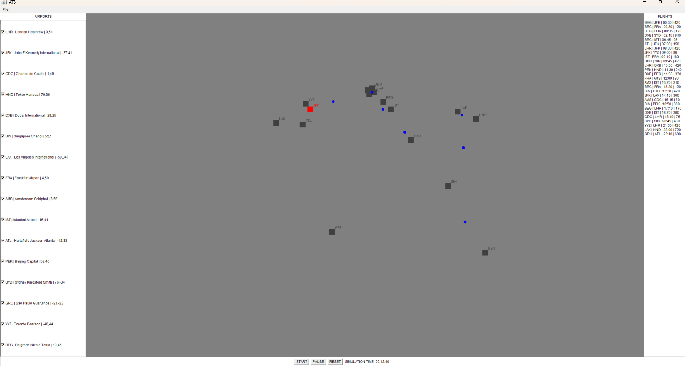

# Air Traffic Simulation (ATS)

This project was developed as part of the Object-Oriented Programming 2 course at the Faculty of Electrical Engineering, University of Belgrade.

The goal of the project was to implement a graphical air traffic simulation application in Java, using AWT for the GUI, with emphasis on object-oriented design principles, clean architecture, and robust error handling.

Since the assignment specification is the intellectual property of the faculty, only a general overview of the required functionality is provided here.

## Features

The application supports the following functionality:

- Manual entry of airports and flights through dialog boxes
- Import and export of airport and flight data in CSV and JSON format
- Visual map display of airports with click-to-select and blinking selection indicator
- Airport visibility filtering
- Real-time flight simulation where 1 real second equals 10 simulated minutes
- Aircraft displayed as blue circles moving linearly between airports
- Departure queue per airport with 10-minute interval enforcement
- Simulation controls: start, pause and reset
- Automatic program shutdown after 60 seconds of inactivity with a 5-second countdown dialog

## Design

The project follows a layered architecture with clearly separated responsibilities:

- **model** – core data classes (`Airport`, `Flight`, `AirportTable`, `FlightTable`, `Coordinate`)
- **logic** – application logic (`Controller`, `Scheduler`, `Clock`, `InactivityTimer`)
- **gui** – graphical components (`MainFrame`, `MapPanel`, `ControlPanel`, `AirportTablePanel`, `FlightTablePanel`)
- **utils** – file handling (`CsvImporter`, `JsonImporter`, `CsvExporter`, `JsonExporter`, `Parser`, `ManualImporter`)
- **exceptions** – custom exception classes for precise error reporting

The application uses the Observer pattern extensively for communication between layers. A singleton `Controller` coordinates all application components.

## Notes

This repository contains my own implementation of the project. The official assignment specification is not included, as it belongs to the course staff.

The application was developed and tested on Windows using Java 8 and the AWT graphics library. JSON support is provided through the Gson library.
